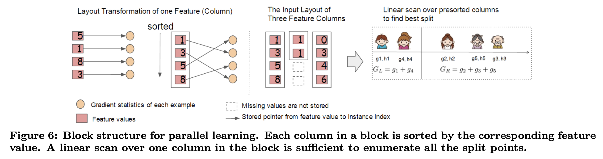

# XGBoost: A Scalable Tree Boosting System

https://www.kdd.org/kdd2016/papers/files/rfp0697-chenAemb.pdf

## Intro

- Highly scalabel end-to-end tree boosting system
- Theoretically justified weighted quantile sketch for efficient proposal calculation
- Sparsity-aware algorithm for parallel tree learning
- Effective cache-aware block structure for out-of-core tree learning

## Tree Boosting in a Nutshell

**Regularized learning objective: **
$$
\mathcal{L}(\phi) = \sum_i l(y_i, \hat{y}_i) + \sum_k \Omega(f_k)
$$

- $\hat{y}_i = \phi(x_i) = \sum_k f_k(x_i)$
- $\Omega(f) = \gamma T + \frac{1}{2}\lambda \|w\|^2$
- $T$: number of leaves
- $w$: weights of leaves

**Gradient tree boosting**

At the $t$-th iteration, we add $f_t$ to minimize the objective:
$$
\mathcal{L}^{(t)} = \sum_i l(y_i, \hat{y}_i^{t-1} + f_t(x_i)) + \Omega(f_t)
$$
To simplify the problem, we can take Taylor expansion of $l$:
$$
l(y_i, \hat{y}_i^{t-1} + f_t(x_i)) = l(y_i, \hat{y}_i^{t-1}) + g_if_t(x_i) + \frac{1}{2}h_if_t(x_i)
$$
Then we can fit the hypothesis $f_t$ to minimize the loss
$$
\tilde{\mathcal{L}}^{(t)} = \sum [ g_if_t(x_i) + \frac{1}{2}h_if_t(x_i)] + \Omega(f_t)
$$
In the setting of regression trees, we have
$$
\tilde{\mathcal{L}}^{(t)} = \sum_j [(\sum_{i \in I_j g_i}w_j + \frac{1}{2}(\sum_i h_i + \lambda)w_j^2] + \gamma T
$$

- $I_j = \{ i : q(x_i) = j\}$ is the set of instance for leaf $j$

Solutions are given by
$$
w_j^* = - \frac{\sum_{i \in I_j} g_i}{\sum_{i \in I_j}h_i + \lambda}
$$
Best split is determined by computing the gain of split
$$
\mathcal{L}_{split} = \frac{1}{2}[\frac{(\sum_{i \in I_L} g_i)^2}{\sum_{i \in I_L}h_i + \lambda} + \frac{(\sum_{i \in I_R} g_i)^2}{\sum_{i \in I_R}h_i + \lambda} - \frac{(\sum_{i \in I} g_i)^2}{\sum_{i \in I}h_i + \lambda}] - \gamma
$$
**Shrinkage and column subsampling**

To deal with overfitting

- Shrinkage by using a learning rate $\eta$ for each tree added
- Column subsampling to add randomness

## Split Finding Algorithm

**Exact greedy algorithm:** enumerate over all the possible splits on all features

**Approximate algorithm ** 

- First proposes candiate splitting points according to percentiles of feature distribution
- Then maps the continuous features into buckets
- Finally find the bset solution among proposed splitting points

**Weighted quantile sketch**

To get the candidate splitting points, we use $h$-weighted quantiles. For $D_k = \{(x_{ik}, h_i)\}$ represent the $k$-th feature values and hessians. We can define a rank function
$$
r_k(z) = \frac{\sum_{(x,h)\in D_k, x<z} h}{\sum_{(x,h) \in D_k} h}
$$
Then we seek splitting points $\{s_{k1},...,s_{kl}\}$ such that
$$
|r_k(s_{k,j}) - r_k(s_{k,j-1})| < \epsilon
$$
with
$$
s_{k1} = min (x_{ik}), \hspace{10px} s_{kl} = max (x_{ik})
$$
**Sparsity-aware split finding**

- Missing values are assigned a default direction
- Compare the gain by assigning to left and right to find the best default direction

## System Design

**Column block for parallel learning**

- Preprocess the data into *Column Sorted Compressed* columns
- Each column corresponds to a feature and sorted by the feature values
- Then linear scan to find the qunatiles

**Cache-aware access**

- The algorithm requires indirect fetch of gradient statistics by row index
- Use a prefetching algorithm

**Blocks for out-of-core computation**

- Block compression: the block is compressed by columns and decompressed on the fly by an independent thread when loading into main memory
- Block sharding: shard the data onto multiple disks in an alternative manner